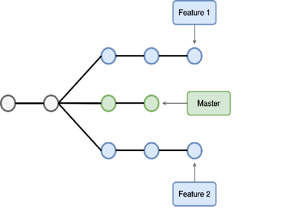
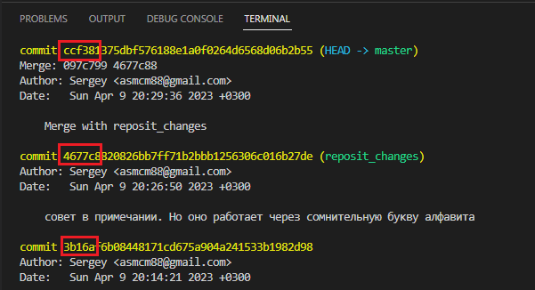

# Работа с Git и GitHub

## 1. Проверка наличия установленного Git.
В терминале выполнить команду `Git version`
Если Git установлен, появится сообщение с информацией о версии программы. Иначе будет сообщение об ошибке.

## 2. Установка Git
Загружаем последнюю версию Git с сайта https://git-scm.com/downloads.
Устанавливаем с настройками по умолчанию.

## 3. Настройка Git
При первом использовании Git необходимо представиться. Для этого нужно ввести в терминале две каманды:
```
git config --global user.name "Ваше имя английскими буквами"
git config --global user.email "Ваша почта@example.com"
```

## 4. Инициализация репозитория
Получить репозиторий можно двумя способами:
1. В терминале перейти к папке, в которой хотим создать репозиторий. Выполняем команду:
```
git init
```
В исходной папке появится скрытая папка *.git*
2. Клонировать существующий репозиторий Git из любого места. Сделать это можно с помощью команды:
```
git clone <адрес репозитория>
```
## 5. Запись изменений в репозиторий

1. Определение состояния файлов. Основной инструмент для определения какие файлы в каком состоянии находятся. Команда:
```
git status
```
`Внимание: рекомендуется после любых серьезных внесений поправок или нового материала проверять состояние файлов. Сбережет вам много МНОГО нервов` 

2. Отслеживание новых файлов. Для того чтобы начать отслеживать (добавить под версионный контроль) новый файл, используется команда:
```
git add <имя файла> 
```
` После добавления файла в отслеживаемое состояние  еще раз проверьте его состояние командой git status`

3. Убрать файл из списка отслеживаемых можно командой:
```
git rm --cached <имя  файла>
```

4. Игнорирование файлов. Для файлов которые вы не хотите видеть в отслеживаемых и которые не хотите добавлять в репозиторий можно создать файл ***.gitignore***
После создания файла вы сможете туда занести __имена файлов__, как в примере ниже:
```
1. commands.txt
2. ...
3. ...
```
`Внимание: не забудьте файл .gitignore добавить в список отслеживаемых  "git add .gitignore"`

5. Для того чтобы увидеть разницу между текущим файлом и сохраненным воспользуйтесь командой:
```
git diff
```
6. Зафиксировать или сохранить изменения (Commit изменений)
Команда:
```
git commit -m "Комментарий" 
git commit -a-m "Комментарий" или git commit -am "Комментарий" (Внесет изменения во все отслеживаемые файлы)
git commit   (пользователя попросят прокомментировать вносимые изменения вызовом команды edit)
```
*Выход из команды edit: на Windows GitBash нажмите Z для входа в режим встроенной вставки. Введите описание в самом верху, нажмите ESC чтобы выйти из режима вставки, введите: :x! и затем нажмите Enter. Если нажать :q!, то вы выйдете из редактора без сохранений*

`Внимание: всё, что до сих пор не проиндексировано — любые файлы, созданные или изменённые вами, и для которых вы не выполнили git add после редактирования — не войдут в этот коммит. `

## 6. Журнал изменений
Одним из основных и наиболее мощных инструментов для просмотра истории коммитов является команда: 
```
git log
```
*Пример:*


*Таблица. Наиболее распространённые опции для команды git log*
 Команда |Описание 
 -------| ------- 
-p | Показывает патч для каждого коммита.
--stat | Показывает статистику изменённых файлов для каждого коммита.
--shortstat | Отображает только строку с количеством изменений/вставок/удалений для команды --stat.
--name-only | Показывает список изменённых файлов после информации о коммите.
--name-status | Показывает список файлов, которые добавлены/изменены/удалены.
--abrev-commit | Показывает только несколько символов SHA-1 чек-суммы вместо всех 40.
--relative-net | Отображает дату в относительном формате (например, «2 weeks ago») вместо стандартного формата даты.
--graph | Отображает ASCII граф с ветвлениями и историей слияний.
--pretty | Показывает коммиты в альтернативном формате. Возможные варианты опций: oneline, short, full, fuller и format (с помощью последней можно указать свой формат).
--oneline | Сокращение для одновременного использования опций --pretty=oneline --abbrev-commit.

`Внимание: переход между версиями вашего проекта осуществляется специальной командой. Раздел 8.`

## 7. Работа с черновиками
Во время работы над проектом может возникнуть ситуация, когда нескольким пользователям понадобиться одновременно внести изменения. Для этого в Git есть возможность создания ветвлений от ___( MASTER )___ файла. 



1. Создать ветку можно командой:
```
git branch <имя ветки>
```
2. Слияние веток выполняется командой:
```
git merge <имя ветки>
```
3. Удалить ветку можно командой:
```
git branch -D <имя ветки> (удаление ветки, если она еще не слилась)
git branch -d <имя ветки> (удаление ветки, если она слилась)
```
`Внимание: слияние веток надо осуществлять из ветки в которую пользователь хочет влить изменения. Воспользуйтесь командой из раздела 8.` 

## 8. Переключение между версиями и ветками.
1. Переключение между версиями проекта осуществляется командой:
```
git checkout <символы из версии>
```
`Внимание: для того чтобы пользователь узнал символы нужной ему версии проекта нужно ввести команду "git log" После этого найти нужную версию проекта и первые 4 символа добавить к команде "git checkout". Нажать клавишу Tab и программа автоматически заполнит наименование нужной пользователю версии.`

*Пример:*



2. Переключение между ветками проекта осуществляется командой:
```
git checkout <имя ветки>
```

## 8. GitHub

## 9. Features