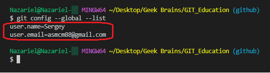
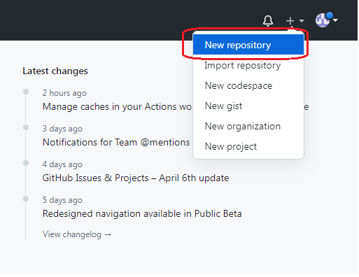
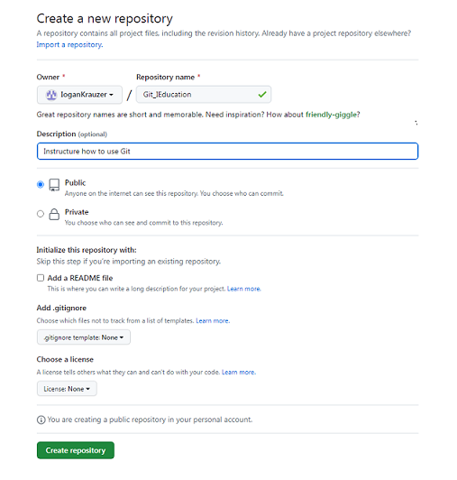

# Работа с Git и GitHub

## 1. Проверка наличия установленного Git.
В терминале выполнить команду `Git version`
Если Git установлен, появится сообщение с информацией о версии программы. Иначе будет сообщение об ошибке.

## 2. Установка Git
Загружаем последнюю версию Git с сайта https://git-scm.com/downloads.
Устанавливаем с настройками по умолчанию.

## 3. Настройка Git
При первом использовании Git необходимо представиться. Для этого нужно ввести в терминале две каманды:
```
git config --global user.name "Ваше имя английскими буквами"
git config --global user.email "Ваша почта@example.com"
```
Проверить результат настройоки можно командой:
```
git config --global --list
```


## 4. Инициализация репозитория
Получить репозиторий можно двумя способами:
1. В терминале перейти к папке, в которой хотим создать репозиторий. Выполняем команду:
```
git init
```
В исходной папке появится скрытая папка *.git*
2. Клонировать существующий репозиторий Git из любого места. Сделать это можно с помощью команды:
```
git clone <адрес репозитория>
```
## 5. Запись изменений в репозиторий

1. Определение состояния файлов. Основной инструмент для определения какие файлы в каком состоянии находятся. Команда:
```
git status
```
`Внимание: рекомендуется после любых серьезных внесений поправок или нового материала проверять состояние файлов. Сбережет вам много МНОГО нервов` 

2. Отслеживание новых файлов. Для того чтобы начать отслеживать (добавить под версионный контроль) новый файл, используется команда:
```
git add <имя файла> 
```
` После добавления файла в отслеживаемое состояние  еще раз проверьте его состояние командой git status`

3. Убрать файл из списка отслеживаемых можно командой:
```
git rm --cached <имя  файла>
```

4. Игнорирование файлов. Для файлов которые вы не хотите видеть в отслеживаемых и которые не хотите добавлять в репозиторий можно создать файл ***.gitignore***
После создания файла вы сможете туда занести __имена файлов__, как в примере ниже:
```
1. commands.txt
2. ...
3. ...
```
`Внимание: не забудьте файл .gitignore добавить в список отслеживаемых  "git add .gitignore"`

5. Для того чтобы увидеть разницу между текущим файлом и сохраненным воспользуйтесь командой:
```
git diff
```
6. Зафиксировать или сохранить изменения (Commit изменений)
Команда:
```
git commit -m "Комментарий" 
git commit -a-m "Комментарий" или git commit -am "Комментарий" (Внесет изменения во все отслеживаемые файлы)
git commit   (пользователя попросят прокомментировать вносимые изменения вызовом команды edit)
```
**Выход из команды edit:**

`Внимание: всё, что до сих пор не проиндексировано — любые файлы, созданные или изменённые вами, и для которых вы не выполнили git add после редактирования — не войдут в этот коммит. `


## 6. Журнал изменений

## 7. Работа с черновиками
 
## 10. GitHub

Инструкция по созданию удаленного репозитория.
* Проведите первоначальную настройку Git. `Раздел 3 - Настройка Git`
* Перейдите и зарегистрируйтесь по ссылке https://github.com
* После процесса регистрации на GitHub пользователю нужно в правом верхнем углу сайта зайти в `New repository`

 

* На открывшейся странице заполните следующие поля: `Repository name`, `Discription` (по - желанию). Также пользователю будет предложено сделать репозиторий `Public` (каждый посетитель может увидеть ваш репозиторий) или `Private` (пользователь может сам выбрать кто сможет увидеть его репозиторий) Поля: `README file` (по - желанию. В этот файл можно внести более подробное описание вашего проекта), `add .gitignore` (по - желанию. Содержит список всех указанных файлов и папок проекта, которые Git должен игнорировать и не отслеживать.), `License` (по-желанию. Отвечает за право других пользователей вносить изменения в ваш код)
* После заполнения полей нажмите зеленую кнопку `Create repository`



* Для активации вашим удаленным репозиторием на GitHub воспользуйтесь следующими командами:
```
git remote add origin https://github.com/IoganKrauzer/Git_IEducation.git (тут должна быть ссылка на ваш профиль)
git push -u origin master
```
Если вы успешно активировали соединение с удаленным репозиторием, то вы увидете следующее:
